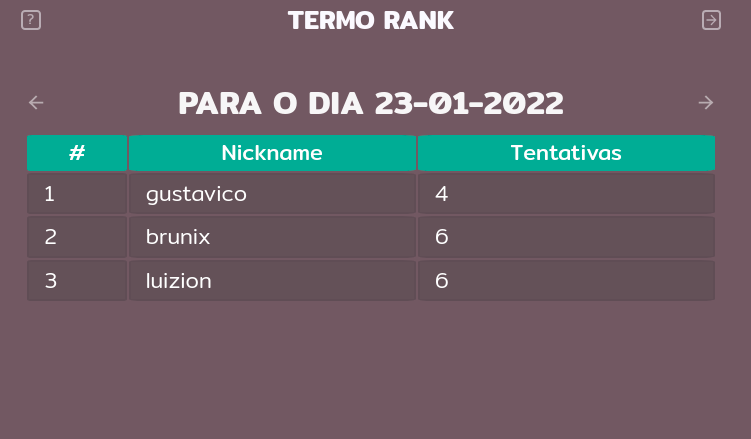
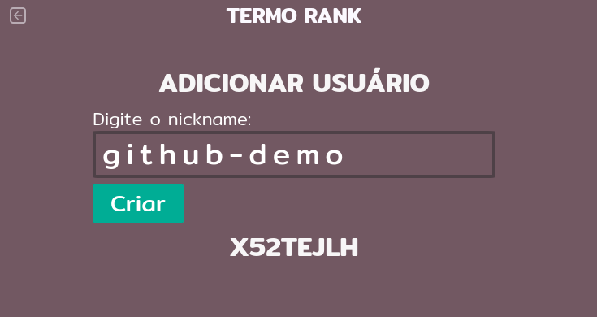

# termo-rank
🟩 Um ranking do jogo de palavras Termo

## 📝 Sobre

Eu e alguns amigos estamos jogando jogos de advinhação de palavras diariamente. Todos os dias, uma palavra nova é sorteada e temos 6 tentativas para descobrir a palavra.

Um deles, é o [Termo](https://term.ooo) que é brasileiro com palavras em português e desenvolvido por [Fernando Serboncini](https://fserb.com).

Dado a ideia de um ranking para que possamos acompanhar e compara nossos resultados dia a dia, eu fiz esse projeto.

## 🧮 Como funciona

Eu mesmo adiciono os usuários e a partir disse forneço um código de acesso para que possam inserir os resultados.

Com o código de acesso, o usuário insere se acertou ou não a palavra de hoje, em quantas tentativas, e pode opcionalmente informar a palavra do dia e mudar seu nickname.

https://user-images.githubusercontent.com/60361387/150683987-53251c14-db20-4691-8e6a-c1c2c616d5da.mp4

## 🧑‍💻 Tecnologias

- **Firebase** como banco de dados (Realtime Database)
- **Next.js** para frontend e API (React, Node.js, Typescript)

> O estilo do projeto é baseado nas folhas de estilo do [Termo](https://term.ooo).
